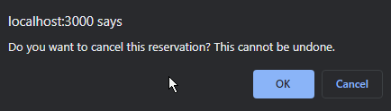

# Restaurant-Reservation

Restaurant-Resrvation is an application to track reservations for a restaurant.

---
## Features:
- create reservations
- view/cancel/edit/seat existing reservations
- list reservations by date
- search for reservation by mobile number
- add tables to restaurant
- list all tables with status
  * *free or occupied*

---
## Technologies & Tools
- React
  - React Hooks
  - React Router
- Node
- Express
- Postgres
- Knex
- Bootsrap
- HTML
- JavaScript

---
### Home Page:

View current date's reservations defaulting to the current date as well as a list of all tables, displayed with status. 

---
### New Reservation:

Create a new reservation. New reservations must have valid propperties including: 

   * a date and time in the future
   * between the hours of 10:30AM (*open*) and 9:30PM (*1 hour before closing to allow for time to eat*)
   * must be on a day the restaurant is open (closed Tuesdays)
   * must have a capacity > 0

---
### New Table:

Add a table to the restaurant.

---
### Search:

Search for an existing reservation by mobile number. Will display all past, present, or future reservations with any status.

Cancel reservation (can only be selected for reservations with the *booked* status.

---
### Seat Reservation:

Seat a reservation at an unoccupied table. Table must have a capacity larger than the reservation size.

Remove a reservation that is seated at a table. Updates reservation status to finished and makes table available for next guests.
